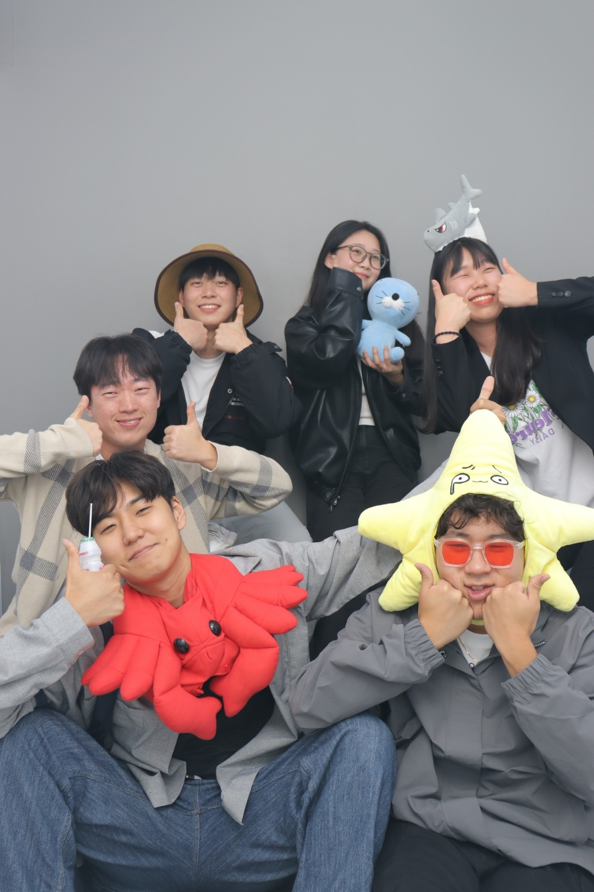
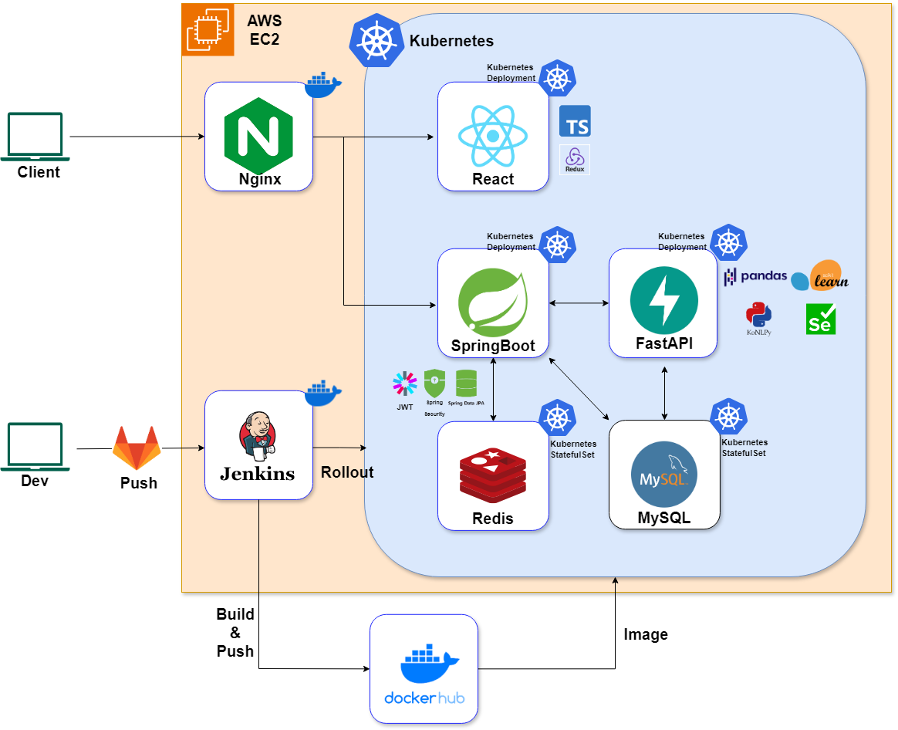
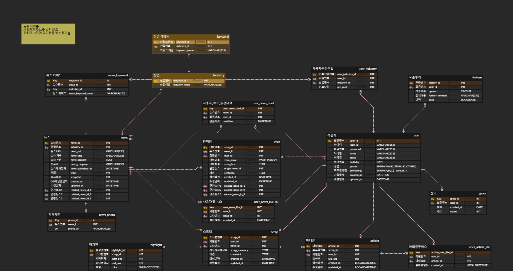

# 🦀 Newscrab 📰

  
  <h3>취업 준비생을 위한 뉴스 추천 및 스크랩 서비스</h3>
  
  

    ✨ <a href="https://www.notion.so/dbf951c031a94dc9b44208d418aa6864">기호지세 팀 노션</a>
  

  

    🎬 <a href="https://youtu.be/qptWyOQ9oOc?si=WgijRPUoiES7-MGI">뉴스크랩 소개 영상</a>
  

  
   
  
  
   
    

   
  
  <h3>🏆 수상 내역</h3>
  

    
SSAFY 11기 특화 프로젝트 - 삼성전자 주식회사

  

  

   
  

### 📜 목차

---

1. [**프로젝트 일정**](#1)
2. [**프로젝트 개요**](#2)
3. [**서비스 소개**](#3)
4. [**주요 기능**](#4)
5. [**기술 스택**](#5)
6. [**산출물**](#6)
7. [**팀원 소개**](#7)
     

### 🗓️ 프로젝트 일정

---

- 일정: 2024년 8월 26일 - 2024년 10월 11일 (7주)
    

### 🔎 프로젝트 개요

---

대부분의 취업준비생들이 최근 이슈와 관련된 문항을 작성할 때, 어려움을 느꼈을 거라 예상합니다.

그렇다면 이를 대비하기 위해서 어떻게 효율적으로 준비하면 좋을까요?

취업 준비 유튜버인 면접왕 이형의 영상에 따르면, 꼭 해야 하는 취업 준비 3가지 중 하나가 바로 뉴스 기사 스크랩이라고 합니다.

단순 기사만 읽는 것이 아니라 본인이 직접 요약하고 정리해 보면서 자소서와 면접에서 필요한 정보를 뽑아내는 것이 중요하다고 합니다.

그래서 저희는 취준생을 타겟팅으로 하여,

사용자가 관심가질만한 뉴스를 골라주고

스크랩을 통해 트렌드 파악 및 요약 능력을 잡아주고

여러분들의 취업 뽀개기에 도움이 되고자

‘뉴스크랩’ 서비스를 기획하였습니다.
 

### 🔎 서비스 소개

---

Newscrab은 취업준비생을 위한 뉴스 추천 및 스크랩 서비스입니다.
 

### 🔎 주요 기능

---

 

### ⚒️ 기술 스택

---

## 기술 스택

- **Frontend**

  
  
  
  
  
  
  
  

- **Backend**

  
  
  
  
  

- **Data**

  
  
  
  
  
  
  

- **Infra**

  
  
  
  
  
  

- **Database**

  
  

- **Tool**

  
  
  

 

### 📜 산출물

---

**🖋️아키텍처 구조도**

  

**🖋️ERD**

  

### 🖋️주요 기능 화면

---

- **타이틀 화면**
   
- **회원 가입**  
- **뉴스 추천**  
- **형광펜**  
- **단어장**  

### 주요 기술

- **뉴스 크롤링**  
- **뉴스 추천**  

---

---

### 👥 팀원 소개

<table>
  <tr>
    <td align="center">
       
      <b>여대기 (Bernie)</b> 
      <i>TeamLeader, Infra, Data, Frontend</i>
    </td>
    <td align="center">
       
      <b>차봉석 (Guevara)</b> 
      <i>Backend</i>
    </td>
    <td align="center">
       
      <b>김동건 (Harry)</b> 
      <i>Backend</i>
    </td>
    <td align="center">
       
      <b>문자영 (Eve)</b> 
      <i>Frontend</i>
    </td>
    <td align="center">
       
      <b>강수연 (Aurora)</b> 
      <i>Data, Frontend</i>
    </td>
    <td align="center">
       
      <b>박범준 (Noah)</b> 
      <i>Frontend</i>
    </td>
  </tr>
</table>
